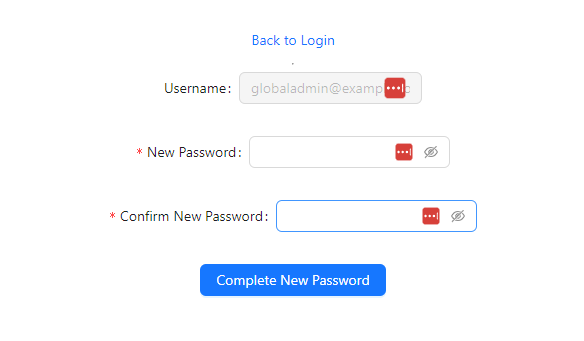
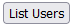
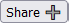

Copyright Amazon.com, Inc. or its affiliates. All Rights Reserved.
SPDX-License-Identifier: MIT-0 
## Demo the Application

 
 

*  <em> **Global Admin Login** </em> 
    - The global admin user creates new Tenant Admin users. Once created Tenant Admin users are provisioned to the corresponding Cognito UserPool Group and in the Tenant Admin dynamodb table.
    - Global Admin user is was created on your behalf via backend CDK solution. Upon login you will be required to perform a change password. 
        - **username**: `globaladmin`
        - **temp password**: `ChangeMe!@12` 

        - 
        
        > **Note:**  Credentials can be modified in the  `backend-resources\cdk-ts-amplify-backend-resource\config\staticConfig.ts` file for now. 

    - You may confirm the properties of the Global Admin and all users within the Amazon Cognito UserPool associated with this solution 
        - Run the command below again in the terminal to generate a link to the Amazon Cognito UserPool: 
            - ` npm run printResources `
            - Click on the link/url following the  **Amazon Cognito Console UserPool Link:** prefix. 

 
 

* <em>**Create new Tenant Admin:** </em> 
    - Upon successful login home page should be presented that provides a link for Global Admin users to create a Tenant Admin User
    - Select the link to create a Tenant Admin and complete the provide fields 
        - **Username**: a unique sequence of characters that will be used as one of the features to identify the user within the application.
            - example: `admintenanta`
        - **Email**: requires a valid email address to deliver the username and auto-generated email to the users. For demo purposes use the  [RFC 5233 standard sub-addressing](https://www.rfc-editor.org/rfc/rfc5233) syntax to create an email that will be delivered to a common email inbox. 
            - example: `myemailalias+admintenanta@emaildomain.com`
                > Note:  do not use this example email as the email needs to be routable to an inbox for which you have access   
        - **Confirm Email**: Input must be identical to the previous field 
            - example: `myemailalias+admintenanta@emaildomain.com`
        - **Tenant** : Select from a pre-populated list of Tenants that this user will administer. TenantA correspond to the user in this example.  
            - example: `TenantA`
        - Click the `Create Tenant Admin` button to submit the action to create the user. A message should appear at the top of the screen:  **User created Successfully** 
          
    - Upon successfully creation of TenantA admin user the following task are completed by backend services deploy via the CDK solution:  
        - A Amazon Cognito Custom message trigger is invoked which emails the new Tenant admin user: 
            - The url of the web application 
            - The username created by the Global Admin
            - A generated temporary password  
        - The user is registered in a DynamoDb table that list tenant admin users and sets the associated attribute named `isAdmin` to true
            - Run the command below again in the terminal to generate a link to view the table in the Amazon Dynamodb Console: 
                - ` npm run printResources `
                - Click on the link/url following the  **Amazon Dynamodb Console Tenant Admin User Table Link:**  prefix. 
          
    - Logout of the Global Admin user account: 
        - Select the `Return Home` Link at the top of the `Create Tenant Admin` page. 
        - Click the `Sign out` button to logout of application 
 
 

* <em>**Access Demo Application as TenantA Admin User** </em> 

    - Upon receiving email generated by Amazon Cognito
    - Click on the url provided in the email to navigate to the web application 
    - Login to the web application using the username and temporary password credentials provided in the email. 
    - Upon logging in with temporary credentials creating a new password is be required 
    - Upon successful password update you will be returned to the login page
    - Log back in with the same username and new password
    - Tenant Admins may take the following actions:
        - View users in the tenant via the  button 
        -  View, Add, and Share Task
            > **NOTE** Share Task via the  button associated with each task 
            > **NOTE** Share the task only with users within the same tenant by typing their username ie `tenantauser1` in the provided field.
        - Upload, Delete, and View Images and Videos
        - Create New Tenant User
            - Select the link labeled `Create New Tenant User` and complete the provide fields to create a general user
                - **Username**: a unique sequence of characters that will be used as one of the features to identify the user within the application.
                    - example: `tenantauser1`
                - **Email**: requires a valid email address to deliver the username and auto-generated email to the users. For demo purposes use the  [RFC 5233 standard sub-addressing](https://www.rfc-editor.org/rfc/rfc5233) syntax to create an email that will be delivered to a common email inbox. 
                    - example: `myemailalias+tenantauser1@emaildomain.com` 
                        > Note:  do not use this example email as the email needs to be rotatable to an inbox for which you have access   
                - **Confirm Email**: Input must be identical to the previous field 
                    - example: `myemailalias+tenantauser@emaildomain.com`
                - Click the `Create User` button to submit the action to create the user. A message should appear at the top of the screen:  **User created Successfully!** 
            - Upon successfully creation of general user the following task are completed by backend services deploy via the CDK solution:
                - The JWT token of the Tenant Admin is validated by Amazon API gateway and then passed with the form data to a lambda function. 
                - The lambda function extracts the tenantId value from JWT and sets the value of the new users Amazon Cognito tenantId custom attribute to the same value.  
                - The new user is then provisioned to the same Amazon Cognito UserPool Group as the Tenant Admin which created the user.
                - A Amazon Cognito Custom message trigger is invoked which emails the new general user: 
                    - The url of the web application 
                    - The username created by the Tenant Admin user
                    - A generated temporary password  
                - You may confirm the properties of the newly created user within the Amazon Cognito UserPool associated with this solution 
                    - Run the command below again in the terminal to generate a link to the Amazon Cognito UserPool: 
                        - ` npm run printResources `
                        - Click on the link/url following the  **Amazon Cognito Console UserPool Link:**  prefix. 
                  
            - Logout of the Tenant Admin user account: 
                - At the top of the current page, select the `Return Home` Link . 
                - Click the `Sign out` button to logout of application 

 
 

* <em>**Access Demo Application as TenantA General User** </em> 

    - Upon receiving email generated by Amazon Cognito
    - Click on the url provided in the email to navigate to the web application 
    - Login to the web application using the username and temporary password credentials provided in the email. 
    - Upon logging in with temporary credentials creating a new password is be required
    - Upon successful password update you will be returned to the login page
    - Log back in with the same username and new password
    - General tenant users may take the following actions:
        -  View, Add, and Share Task
            > **NOTE** Share Task via the  button associated with each task 
            > **NOTE** Share the task with other users in the same tenant by typing their username ie `admintenanta` in the provided field.
            - To create and share a task: 
                - Select the `My Task ` link on the home page
                - Select the  button to add a new task
                - Notate text in the content field of the popup dialog box ie `My Shared Task`
                - Select the   button associated with the task
                - Type in the username for a TenantA user ie `admintenanta` in this demo example
                - The associated tenant user should immediately see the task in their task list. 
                    > **NOTE** In this demo application shared task will only be displayed the task view of users within the same tenant. 
        - Upload, Delete, and View Images and Videos
        - Logout of the General tenant user account: 
            - At the top of the current page, select the `Return Home` Link . 
            - Click the `Sign out` button to logout of application 
 

   - [Teardown Instructions](./TearDownInstructions.md)

