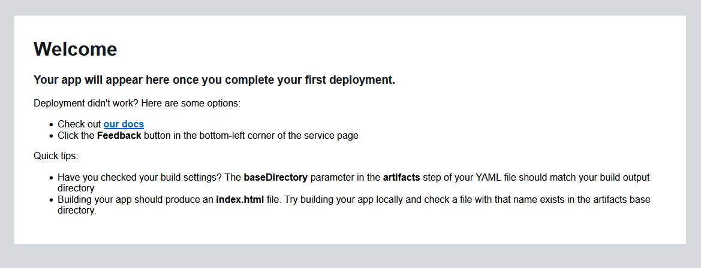
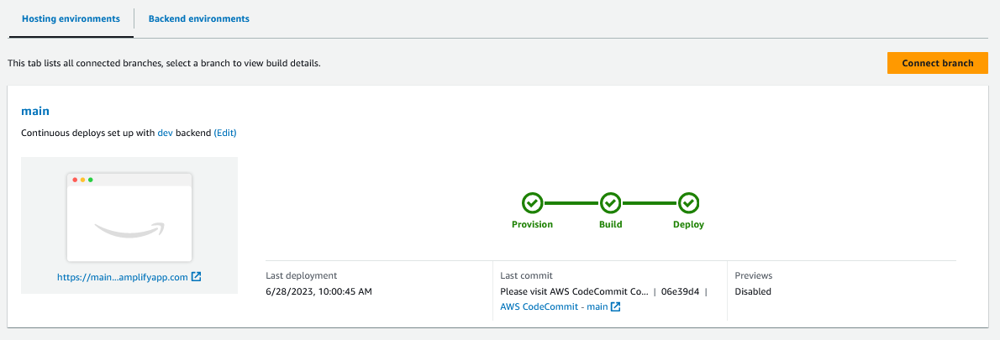
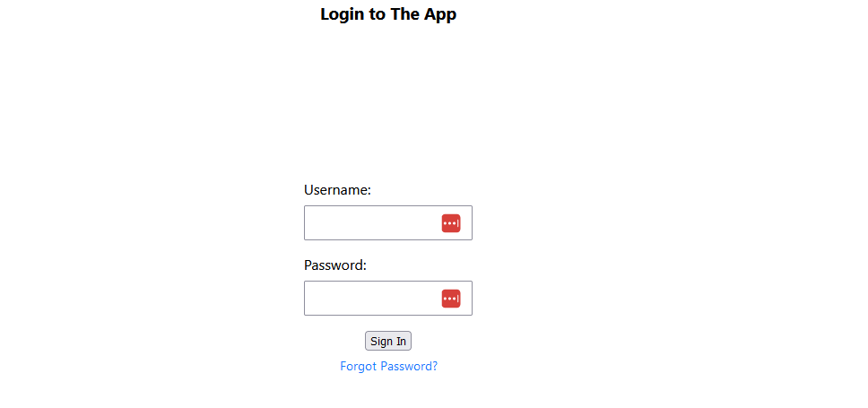

Copyright Amazon.com, Inc. or its affiliates. All Rights Reserved.
SPDX-License-Identifier: MIT-0
## Setup Instructions : 

- Clone repo to your local file system 

- Change Directory to CDK Backend Solution and Install
    - `cd .\serverless-multi-tenant-aws-amplify-application\backend-resources\cdk-ts-amplify-backend-resource\`
    - `npm install `      
    - `cdk deploy `
    - Select `y` to deploy resources via the AWS CDK       
    > **_NOTE:_**  
            - Requires AWS CDK installed and configured 

- Now that the Backend Deployment has successfully completed lets change Directory back to root of amplify project 
    - ` cd ..\..\`
- Install bits required to run the helper utility file and run app locally if desired
    - `npm install  `

    - View the default webpage of our Amplify environment deployed via the CDK backend: 
        - The default ULR is the http://YourAmplifyAppID.amplifyapp.com

        - A utility file is included in this project for ease of reference, run the below command in the terminal to generate your Amplify App URL: 
            - ` npm run printResources `

        - Click on the link/url following the **Amplify URL:** prefix. You should see a view similar to this image below:
        - 

- Push the source code to your AWS CodeCommit Repository created via CDK backend project  
    > **Note** This section assumes **git-remote-codecommit** is installed via python pip. 
        - [If not installed follow steps 1 and 2 in this guide](./codecommit.md#git-remote-codecommit-setup)

    - Commit all changes on your local system generated on your system
        - ` git add .`
        - ` git commit -m "Deploy the App" `

    - Run the printResource command again and this time **copy**  the text following the **Git Remote:**  label 
         - ` npm run printResources `

    - Paste the text directly into the command-line terminal and modify, if needed, to reflect with your aws profile name. 
        > **Note** [See step 3 in this guide for additional information on using AWS CLI Profiles with CodeCommit](./codecommit.md#git-remote-codecommit-setup)  

    - Press the `Enter` key to execute the command and add the codecommit repo as a git remote 

    - Confirm the codecommit remote was successfully added:  
        - `git remote -v `

    - Push your commits to the CodeCommit Repository: 
        - ` git push -u codecommit main` 

    - The Amplify console provides a visual of the CICD pipeline that builds and deploys the application update triggered by the new commit.
            - Run the printResource command again and this time either **click on the link** or **copy**  the text following the **Amplify Console Link:**  label and paste it in your browser to navigate to the Amplify Console  
                - ` npm run printResources `
    - In the console select the **Hosting environments** tab to view the Amplify CICD pipeline visual. You should see a view similar to this image below:

        - 

- View the updated app

    - Via the Amplify provided default URL: 
        - Run the command below again in the terminal to generate your Amplify App URL: 
            - ` npm run printResources `
        - Click on the link/url following the  **Amplify URL:**  prefix. 
        

    - Via NodeJS on local system 
        - Run the following command to run the application locally
            - `npm run start`

    - Either option above should provide a view similar to this image below:
        - 

 

   - [Follow the instructions in this guide to demo the application](./DemoInstructions.md)

